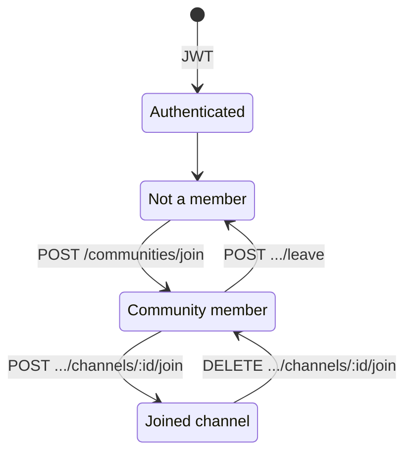

# Mishka Backend

Production REST API for the **Mishka** Flutter study partner. This service owns authentication, persistence, authorization, study sessions, communities, gamification, and report delivery. An optional upstream FastAPI tutor handles model inference; Express proxies those calls and materializes durable records in PostgreSQL.

| | |
|---|---|
| **Runtime** | Node.js 18+, Express 5 |
| **Data** | PostgreSQL via Prisma |
| **Auth** | JWT (Bearer) + Google / Apple / Facebook OAuth |
| **Docs** | OpenAPI 3 — [`/api-docs`](http://localhost:3000/api-docs) · [`/openapi.json`](http://localhost:3000/openapi.json) |
| **Deploy** | Docker / Railway (`Dockerfile`, `railway.toml`) |

---

## Architecture

```
Flutter clients
      │  HTTPS + Bearer JWT
      ▼
┌─────────────────────────────────────────┐
│  Express API (this repo)                │
│  · Auth, RBAC, validation (Zod)         │
│  · Domain APIs (study, community, …)    │
│  · Envelope middleware + i18n messages  │
│  · PDF export, email, cron hooks        │
└───────────┬─────────────┬───────────────┘
            │             │
            ▼             ▼
      PostgreSQL     AI_SERVICE_URL
      (Prisma)       (FastAPI tutor)
            │             │
            │             └─ /upload · /chat · /generate-tools
            └─ durable sessions, materials, uploads on disk
```

**Design principles**

- **Stable client contract** — every JSON response uses a common envelope (`success`, `message` / `message_en` / `message_ar`, `data`, `error`, `details`).
- **Server-side trust boundaries** — OAuth tokens are verified here; AI tutor wire format is preserved; clients never write AI `senderType` messages.
- **Own-your-data by default** — non-admins are scoped to their JWT `sub`; catalog and global user admin routes require `admin`.
- **OpenAPI as source of truth** — interactive docs and codegen live at `/api-docs`; this README stays high-level.

---

## Capabilities

| Domain | Summary |
|--------|---------|
| **Auth & profile** | Register / login, signup OTP, password reset, OAuth (Google, Apple, Facebook), avatar upload, education profile |
| **AI tutor** | Proxy upload / chat / tool generation; persist sessions, messages, quizzes, flashcards, mind maps, summaries |
| **Study With Mishka** | Concentration & call modes, timer state (client-polled), telemetry, ML report ingest, period rollups |
| **Your Report** | Aggregated study / AI / tasks / streak / community insights; PDF export; optional email (Resend or SMTP) |
| **Tasks** | Todo lists and standalone tasks with filters for home widgets and completion reports |
| **Communities** | Public / private groups, invites, channels, chat, material shares, discovery & recommendations |
| **Gamification** | Points, badges, goals, progress (see Flutter handoff docs) |
| **Ops** | Scheduled report emails via `CRON_SECRET`-protected internal route (or in-process cron) |

Detailed Flutter handoffs live under [`docs/`](docs/).

---

## Quick start

**Prerequisites:** Node.js 18+, PostgreSQL, and (optional) the AI tutor service reachable at `AI_SERVICE_URL`.

```bash
npm install
cp .env.example .env
npx prisma migrate dev
npm start
```

| Check | URL / command |
|-------|----------------|
| Health | `GET /` |
| Swagger UI | `GET /api-docs` |
| Smoke test | `npm run test:smoke` (server must be running) |
| Postman | Import `postman/Mishka-Hardened.postman_collection.json`; set `token` from login |

Migrations in CI/CD: `npx prisma migrate deploy` (also runs on container start).

---

## Configuration

Copy `.env.example` → `.env`. Secrets belong in the environment or a secret manager — never in source control.

### Required (local / production)

| Variable | Purpose |
|----------|---------|
| `DATABASE_URL` | PostgreSQL connection string |
| `JWT_SECRET` | Signing key for access tokens (**strong, unique in production**) |
| `CORS_ORIGIN` | Comma-separated origins; avoid `*` in production |
| `PORT` | HTTP listen port (default `3000`) |

### Commonly used

| Variable | Purpose |
|----------|---------|
| `JWT_EXPIRES_IN` / `JWT_REMEMBER_ME_EXPIRES_IN` | Token TTL (`7d` / `30d` by default) |
| `AI_SERVICE_URL` | Upstream FastAPI base URL |
| `AI_UPLOAD_STORAGE_DIR` | On-disk copies of tutor uploads (default `data/ai-uploads`) |
| `NODE_ENV` | `development` enables richer error details |
| `DISABLE_SWAGGER` | Set `true` to hide `/api-docs` in locked-down environments |
| `SWAGGER_SERVER_URL` | Server URL shown in Swagger “Try it out” |
| `GOOGLE_OAUTH_CLIENT_IDS` | Comma-separated Google client IDs (`aud`) |
| `APPLE_CLIENT_IDS` | Apple bundle / Services IDs |
| `FACEBOOK_APP_ID` / `FACEBOOK_APP_SECRET` | Facebook Login verification |
| `RESEND_API_KEY` / `RESEND_FROM` | Preferred email path (e.g. Railway) |
| `SMTP_*` | Alternative SMTP delivery |
| `REPORT_EXPORT_BASE_URL` | Public base URL for PDF links in email |
| `CRON_SECRET` | Protects `POST /internal/cron/scheduled-report-emails` |
| `AVATAR_BASE_URL` | Public base for profile image URLs |

### Production hardening (checklist)

- [ ] Strong `JWT_SECRET`; never rely on the code fallback
- [ ] `DISABLE_SIGNUP_OTP_BYPASS=true` (reject placeholder OTP `111111`)
- [ ] `RETURN_RESET_CODE_IN_RESPONSE` and `RETURN_SIGNUP_OTP_IN_RESPONSE` **false**
- [ ] Restrict `CORS_ORIGIN`; keep OAuth client secrets server-side only
- [ ] Persist `AI_UPLOAD_STORAGE_DIR` (and report exports) on a volume; include in backups with the database
- [ ] Prefer Resend over Gmail SMTP on platforms that block outbound SMTP

Full variable reference: [`.env.example`](.env.example).

---

## API conventions

### Response envelope

```json
{
  "success": true,
  "message": "Localized short summary",
  "message_en": "English summary",
  "message_ar": "Arabic summary",
  "data": {},
  "error": null,
  "details": null
}
```

Failures set `success: false`, `data: null`, a stable machine `error` code (e.g. `AUTH_INVALID_CREDENTIALS`), and optional `details`. Send `Accept-Language: ar` to prefer Arabic in `message`; both language fields are always returned.

### Authentication

Most routes require:

```http
Authorization: Bearer <accessToken>
```

**Public (no JWT):** `/`, `/openapi.json`, `/api-docs`, `/public/app-settings` (GET), signup OTP, register, login, forgot/reset password, OAuth callbacks, and tokenized report download URLs.

**Roles** (`student` | `teacher` | `admin` in the JWT): admins may list users, manage catalog resources, and cross-user access where the API allows. Promote an admin in the database, then re-login so the token picks up `role`:

```sql
UPDATE users SET role = 'admin' WHERE email = 'your@email.com';
```

**Password policy:** 8–20 characters, at least one upper, one lower, and one special (non-alphanumeric) character.

Auth, profile, and OAuth request shapes are documented under the **Auth** tag in Swagger.

---

## Domain overview

### AI tutor bridge

| Express | Upstream | Persistence (after HTTP 2xx) |
|---------|----------|------------------------------|
| `POST /upload` | multipart → FastAPI `/upload` | Chat session, messages, `ai_requests`, file under `AI_UPLOAD_STORAGE_DIR` |
| `POST /chat` | query params → `/chat` | Append messages + `ai_requests` |
| `POST /generate-tools` | query params → `/generate-tools` | Quizzes / flashcards / mind maps + history |

Wire format is owned by the AI service; Node does not alter it. Persistence failures are logged; the client still receives the upstream body inside the envelope. Contract parsing: `services/aiTutorContract.js`, `services/aiMaterializers.js`, `services/aiPersistence.js`.

### Study, reports, tasks, communities

- **Study With Mishka** — `/study-with-mishka/*` (timers are snapshots with `serverNow`; poll while active).
- **Your Report** — `/reports/your-report*` and related preference / export routes; see [`docs/FLUTTER_YOUR_REPORT_HANDOFF.md`](docs/FLUTTER_YOUR_REPORT_HANDOFF.md).
- **Tasks** — `/todo-lists`, `/tasks` (standalone tasks allowed without a list).
- **Communities** — `/communities/*` (membership → channel join → messages / shares). Full discover flow: [`docs/FLUTTER_COMMUNITY_DISCOVER_HANDOFF.md`](docs/FLUTTER_COMMUNITY_DISCOVER_HANDOFF.md).



---

## Project layout

```
controllers/     HTTP handlers
routes/          Express routers
services/        Domain logic (AI persistence, study, reports, gamification, …)
middleware/      Auth, RBAC, validation, envelope, uploads, cron gate
validation/      Zod schemas
prisma/          Schema + migrations
swagger/         OpenAPI assembly
docs/            Flutter handoffs & backend change notes
scripts/         Verification helpers (local / staging)
tests/           Smoke tests
```

---

## Documentation index

| Document | Audience |
|----------|----------|
| [`/api-docs`](http://localhost:3000/api-docs) | All engineers — live contract |
| [`docs/FLUTTER_BACKEND_CHANGELOG.md`](docs/FLUTTER_BACKEND_CHANGELOG.md) | Cross-cutting Flutter ↔ API changes |
| [`docs/FLUTTER_YOUR_REPORT_HANDOFF.md`](docs/FLUTTER_YOUR_REPORT_HANDOFF.md) | Your Report client integration |
| [`docs/FLUTTER_COMMUNITY_DISCOVER_HANDOFF.md`](docs/FLUTTER_COMMUNITY_DISCOVER_HANDOFF.md) | Community discovery |
| [`docs/FLUTTER_GAMIFICATION_BACKEND_HANDOFF.md`](docs/FLUTTER_GAMIFICATION_BACKEND_HANDOFF.md) | Gamification |
| [`docs/FLUTTER_STUDENT_SUBJECTS_HANDOFF.md`](docs/FLUTTER_STUDENT_SUBJECTS_HANDOFF.md) | Student subjects |
| [`docs/YOUR_REPORT_BACKEND.md`](docs/YOUR_REPORT_BACKEND.md) | Study period / report APIs |

---

## License

ISC — see `package.json`.
